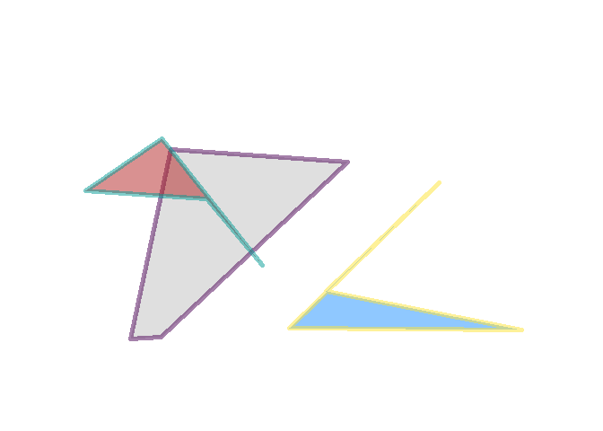
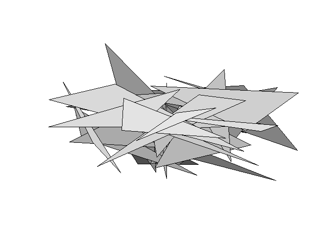
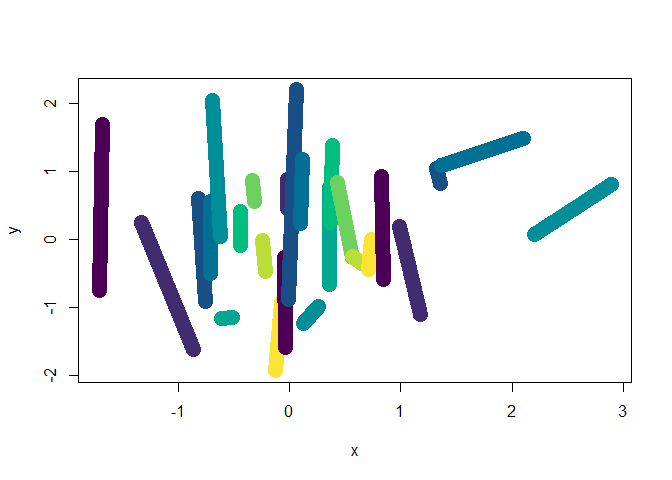
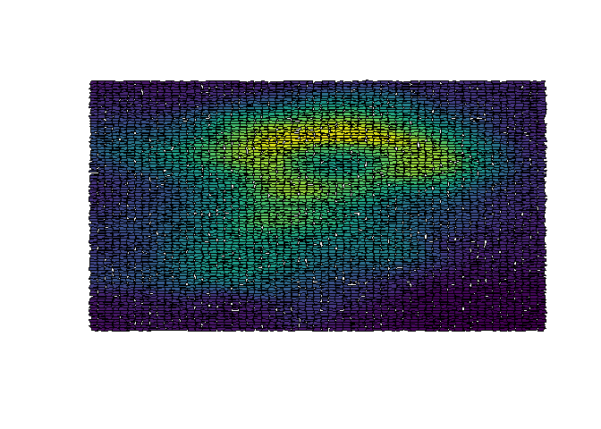
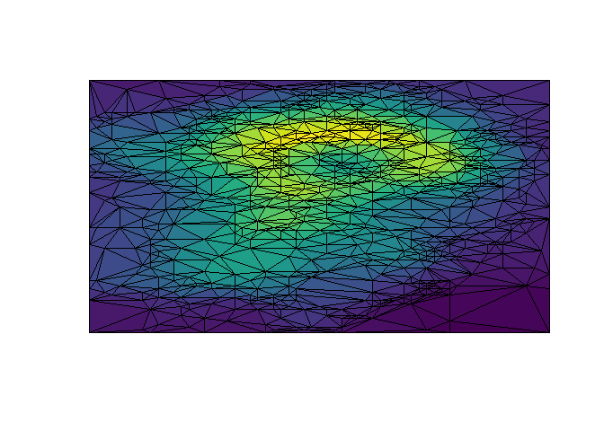

<!-- README.md is generated from README.Rmd. Please edit that file -->

# mesh2d

<!-- badges: start -->

<!-- badges: end -->

The goal of mesh2d is to provide plotting helpers analogous to some rgl
functions.

Currently

  - `segments2d`
  - `triangles2d`
  - `quads2d`

## Installation

You can install the dev version of mesh2d from github with

``` r
## install.packages("remotes")
remotes::install_github("mdsumner/mesh2d")
```

## Example

``` r
library(mesh2d)
quads2d(runif(12), runif(12), border = hcl.colors(3), lwd = 5, col = c("grey", "firebrick", "dodgerblue"), alpha = 0.5)
```



``` r


triangles2d(rnorm(99), rnorm(99), col = gray.colors(33), add = FALSE)
```



``` r
segments2d(sort(rnorm(50)), rnorm(50), col = hcl.colors(10), add = FALSE, lwd = 15)
```



``` r
qm <- quadmesh::quadmesh(volcano)

xx <- qm$vb[1, qm$ib]
yy <- qm$vb[2, qm$ib]
quads2d(jitter(xx, 1.1), jitter(yy, 1.2), col = colourvalues::color_values(t(volcano)), add = FALSE)
```



``` r


tm <- anglr::as.mesh3d(raster::raster(volcano), max_triangles = 1500)

xx <- tm$vb[1, tm$it]
yy <- tm$vb[2, tm$it]
triangles2d(xx, yy, col = colourvalues::color_values(colMeans(matrix(tm$vb[3, tm$it], 3))), add = FALSE)
```



``` r


## same as in rgl (but without the per-vertex colour)
#rgl::triangles3d(xx, yy, tm$vb[3, tm$it], color = colourvalues::colour_values(tm$vb[3, ]))
```

## Code of Conduct

Please note that the mesh2d project is released with a [Contributor Code
of
Conduct](https://contributor-covenant.org/version/2/0/CODE_OF_CONDUCT.html).
By contributing to this project, you agree to abide by its terms.
